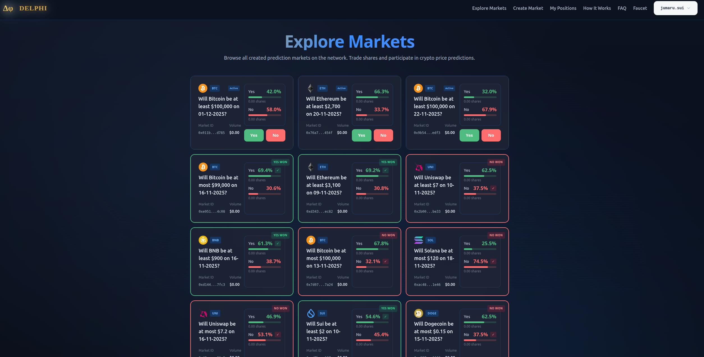

# Delphi: Binary Prediction Markets on Sui

Delphi is a decentralized prediction market platform built on the Sui blockchain that enables users to create and trade binary markets on crypto price predictions. The platform combines **Automated Market Making (AMM)** with **Trusted Execution Environment (TEE) oracles** to provide verifiable, trustless market creation and resolution.

🌐 **Live Testnet Application**: [https://delphimarket.wal.app/](https://delphimarket.wal.app/)

📹 **Demo Video**: [Watch on YouTube](https://youtu.be/e_NOJoVdunI)

  

## Overview

Delphi allows anyone to create binary prediction markets (Yes/No questions) about cryptocurrency prices, such as:

- "Will Bitcoin price be higher than $100,000 at the closing of 11-12-2025?"
- "Will Ethereum price be less than or equal to $5,000 on 15-01-2026?"

> **Note**: Cryptocurrency price predictions are the initial supported market type. The platform is designed to expand and support a wide variety of prediction markets in the future, including traditional assets, sports, events, and more.

Users can trade shares representing their beliefs, with prices dynamically adjusting based on market sentiment through the Logarithmic Market Scoring Rule (LMSR) AMM mechanism.

## Key Features

- **Verifiable Market Creation**: All markets are verified by a TEE oracle (AWS Nitro Enclave) before creation, ensuring questions are valid and answerable
- **Automated Market Making**: LMSR-based AMM provides continuous liquidity and dynamic pricing based on market sentiment
- **Trustless Resolution**: Market outcomes are verified on-chain using cryptographically signed responses from the TEE oracle
- **Collective Intelligence**: Early correct predictions and contrarian positions are rewarded more, incentivizing accurate forecasting
- **Transparent & Auditable**: All enclave code is publicly verifiable, and market data is on-chain
- **Decentralized Frontend**: The frontend is hosted on [Walrus Sites](https://docs.wal.app/walrus-sites/intro.html), ensuring it is verifiable, freely accessible to anyone, and resistant to censorship.

## Value Proposition

Delphi incentivizes collective intelligence by:

- **Rewarding early accurate predictions**: Users who correctly predict outcomes early receive higher returns
- **Encouraging contrarian positions**: Betting against the crowd when correct yields greater rewards
- **Providing market insights**: The dynamic pricing mechanism reveals collective market sentiment in real-time
- **Ensuring trust**: TEE oracle verification guarantees that market outcomes are based on verifiable, tamper-proof data

## How It Works

### 1. Market Creation

Anyone can format a question about a crypto price prediction. The question is sent to the TEE oracle (Nitro Enclave), which:

- Validates that the coin is supported
- Confirms the question format is valid
- Returns the question data with a cryptographic signature

The signed data is then submitted to the Sui smart contract, which verifies the signature against the registered enclave public key and PCRs before creating the market.

### 2. Trading Phase

Once created, users can:

- **Buy YES shares** if they believe the prediction will be true
- **Buy NO shares** if they believe the prediction will be false
- **Sell shares** at any time before the market freezes

The AMM automatically adjusts prices based on the ratio of YES/NO shares:

- 50/50 split → equal prices (~0.5 per share)
- More YES shares → YES becomes more expensive, NO becomes cheaper
- More NO shares → NO becomes more expensive, YES becomes cheaper

This dynamic pricing reflects the collective market sentiment and provides insights into the probability of each outcome.

### 3. Market Freeze

Trading stops at a predetermined time before the resolution date, preventing last-minute manipulation.

### 4. Market Resolution

When the resolution time arrives, any user can:

- Query the TEE oracle for the answer to the question
- Receive the closing price data with a cryptographic signature
- Submit the signed resolution to the smart contract

The contract verifies the signature and resolves the market, determining the winning outcome (YES or NO).

### 5. Payout Distribution

After resolution:

- **Winning side holders** share the entire collateral pool pro-rata based on their share holdings
- **Losing side holders** receive nothing

This creates a pari-mutuel style pool where early correct predictions and contrarian positions (when most traders bet the opposite) are rewarded more than latecomers.

> **Development Note**: During this initial Proof of Concept (PoC) phase, more relaxed rules are applied to facilitate testing:
>
> - Markets can be created for past prices (allowing immediate testing of resolution)
> - No freezing period is enforced (trading continues until resolution)
>
> These restrictions will be properly enforced in production to ensure market integrity.

## Architecture

Delphi consists of three main components:

1. [**TEE Oracle (Rust/Nitro Enclave)**](./src/nautilus-server/src/apps/delphi/mod.rs): Validates questions, fetches crypto price data from external APIs, and provides cryptographically signed responses. The enclave code is publicly verifiable through reproducible builds.

2. [**Sui Smart Contract (Move)**](./move/delphi/sources/delphi.move): Implements the LMSR AMM, manages market lifecycle, verifies enclave signatures, and handles share trading and payouts.

3. [**Frontend (React/TypeScript)**](./delphi-frontend/): Provides a user-friendly interface for creating markets, trading shares, and resolving markets. **Live at**: [https://delphimarket.wal.app/](https://delphimarket.wal.app/). The frontend is hosted on [Walrus Sites](https://docs.wal.app/walrus-sites/intro.html), which provides several key benefits:
   - **No server management**: Publishing doesn't require managing servers or complex configurations
   - **Ownership & control**: The site is owned by a Sui address and can be updated, exchanged, or shared like any Sui object
   - **Censorship resistance**: Thanks to Walrus's decentralization and high data availability, the site cannot be taken down or wiped
   - **Verifiable & accessible**: Anyone can verify the site contents and access it freely through any Walrus portal
   - **Human-readable names**: Leverages SuiNS naming system for memorable domain names

> **Development Note**: During the initial development phase, a **pseudo-enclave** API ([`pseudo-enclave-api`](./pseudo-enclave-api/src/server.ts)) and corresponding Move contract ([`pseudo-enclave`](./move/pseudo-enclave/sources/enclave.move)) are used instead of a full AWS Nitro Enclave deployment. This allows for easier testing and development without the additional infrastructure costs and complexity. The pseudo-enclave maintains the same interface and signature verification logic, making it a drop-in replacement for testing purposes.

## Technical Foundation

Delphi is built on top of [Nautilus](https://docs.sui.io/concepts/cryptography/nautilus), Sui's framework for verifiable off-chain computation. The TEE oracle uses AWS Nitro Enclaves with reproducible builds, allowing anyone to verify that the running code matches the public repository.

For more details on Nautilus, see the [Nautilus documentation](https://docs.sui.io/concepts/cryptography/nautilus/nautilus-design).

## License

This project is licensed under the Apache 2.0 license.
